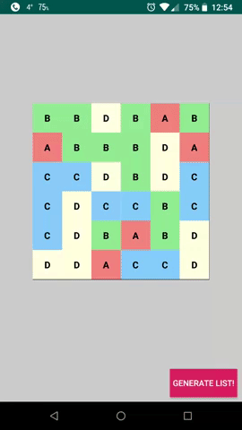

# AutoNotifyAdapterDelegate
Kotlin delegate extension for Android RecyclerView Adapter item list which uses [DiffUtil](https://developer.android.com/reference/android/support/v7/util/DiffUtil) to automatically dispatch updates to adapter.



### Usage

If you hold a list of items inside RecyclerView.Adapter class, simply use autoNotifyDelegate to automatically dispatch updates to the view.
```kotlin
class SampleAdapter : RecyclerView.Adapter<SampleViewHolder>() {

    private var itemList: List<SampleItem> by autoNotifyDelegate(
        adapter = this,
        initialValue = listOf(),
        async = true
    )
    
    fun setItems(itemList: List<SampleItem>) {
        this.itemList = itemList
    }
    
    (...)
}
```

Note: `SampleItem` class has to implement `DiffItem` interface:

```kotlin
class SampleItem(
    val id: Int,
    var name: String
) : DiffItem {
    override fun getItemId() = id.toString()
    override fun getDiff() = name
}
```

`getItemId()`: the value that specifies whether this specific item is different from another (generally some kind of ID)
`getDiff()`: the value that specifies whether this specific item's content differs from another with the same id

### Download

```groovy
implementation 'com.adid.adapterdelegate:autonotifyadapterdelegate:1.0.2'
```

### Licence

Copyright (c) 2018 Adrian Defus

Licensed under the Apache License, Version 2.0 (the "License");
you may not use this file except in compliance with the License.
You may obtain a copy of the License at

    http://www.apache.org/licenses/LICENSE-2.0

Unless required by applicable law or agreed to in writing, software
distributed under the License is distributed on an "AS IS" BASIS,
WITHOUT WARRANTIES OR CONDITIONS OF ANY KIND, either express or implied.
See the License for the specific language governing permissions and
limitations under the License.
